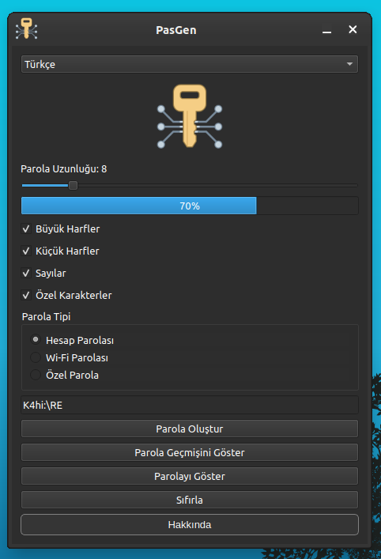

<a href="#">
    
</a>

# PasGen
An app for creating strong and secure passwords  PasGen is a desktop application that helps users create strong and secure passwords.  The app allows you to choose different character types, length and password type to suit specific needs. Cross Platform Operable

<h1 align="center">PasGen Logo</h1>

<p align="center">
  
</p>


----------------------

# Linux Screenshot
  

# Windows Screenshot
 

--------------------
Install Git Clone and Python3

Github Package Must Be Installed On Your Device.

git
```bash
sudo apt install git -y
```

Python3
```bash
sudo apt install python3 -y 

```

pip
```bash
sudo apt install python3-pip

```

# Required Libraries

PyQt5
```bash
pip install PyQt5
```
PyQt5-sip
```bash
pip install PyQt5 PyQt5-sip
```

PyQt5-tools
```bash
pip install PyQt5-tools
```

Required Libraries for Debian/Ubuntu
```bash
sudo apt-get install python3-pyqt5
sudo apt-get install qttools5-dev-tools
```

cryptography
```bash
pip install cryptography

```

System Dependencies (packages that can be installed with apt)
```bash
sudo apt-get install python3 python3-pip python3-pyqt5 python3-pyqt5.qtwebkit python3-pyqt5.qtsvg

```

----------------------------------


# Installation
Install PasGen

```bash
sudo git clone https://github.com/cektor/PasGen.git
```
```bash
cd PasGen
```

```bash
python3 pasgen.py

```

# To compile

NOTE: For Compilation Process pyinstaller must be installed. To Install If Not Installed.

pip install pyinstaller 

Linux Terminal 
```bash
pytohn3 -m pyinstaller --onefile --windowed pasgen.py
```

Windows VSCode Terminal 
```bash
pyinstaller --onefile --noconsole pasgen.py
```

MacOS VSCode Terminal 
```bash
pyinstaller --onefile --noconsole pasgen.py
```

# To install directly on Windows or Linux


Linux (based debian) Terminal: Linux (debian based distributions) To install directly from Terminal.
```bash
wget -O Setup_Linux64.deb https://github.com/cektor/PasGen/releases/download/1.00/Setup_Linux64.deb && sudo apt install ./Setup_Linux64.deb && sudo apt-get install -f -y
```

Windows Installer CMD (PowerShell): To Install from Windows CMD with Direct Connection.
```bash
powershell -Command "Invoke-WebRequest -Uri 'https://github.com/cektor/PasGen/releases/download/1.00/Setup_Win64.exe' -OutFile 'Setup_Win64.exe'" && start /wait Setup_Win64.exe
```

Release Page: https://github.com/cektor/PasGen/releases/tag/1.00

----------------------------------
